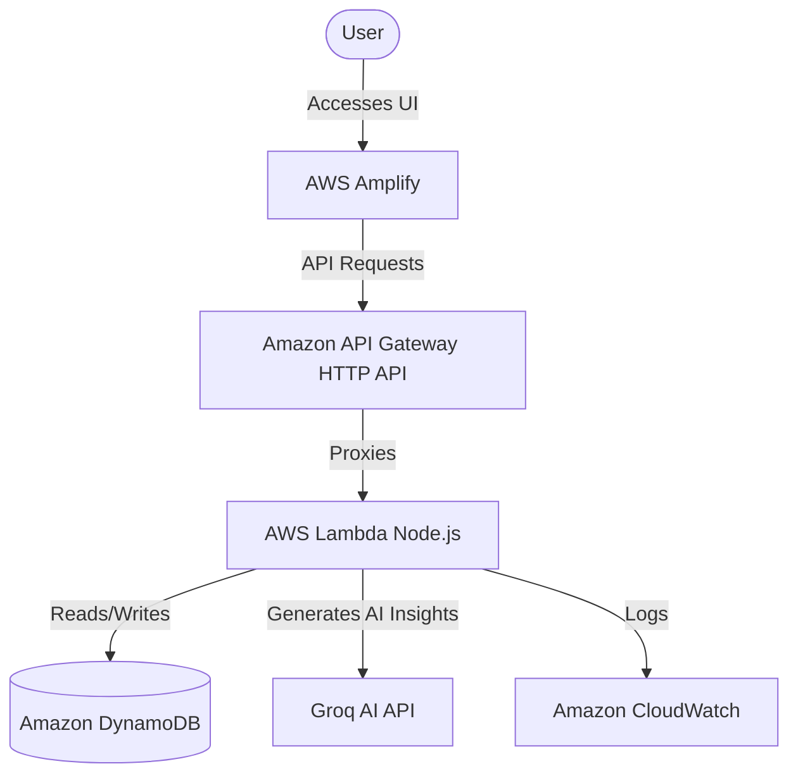

# Meeting2Tasks

Meeting2Tasks is an AI-powered SaaS application that eliminates the annoying task of manually reading meeting notes by instantly converting them into structured summaries, actionable items, identified risks, and key decisions.

## Architecture Overview

The application is built on a modern, serverless AWS infrastructure using React on the frontend and Node.js on the backend.



## Folder Structure

- `/frontend` - React 19 application (Vite, TailwindCSS, TanStack Query)
- `/backend` - Express API wrapped for AWS Lambda (TypeScript, Groq SDK, AWS SDK)
- `/infrastructure` - AWS SAM templates and deployment scripts
- `amplify.yml` - Build configuration for AWS Amplify

## Prerequisites

1. **AWS Account**: An active AWS account.
2. **AWS CLI**: Installed and configured with your credentials (`aws configure`).
3. **AWS SAM CLI**: Installed for backend deployment.
4. **Node.js**: Installed locally (v20+).
5. **Groq API Key**: You need an API key from Groq to power the AI summarization.

## Environment Variables

A `.env.example` file is provided at the root of the project.

```env
# Backend / Groq AI Settings
GROQ_API_KEY=your_groq_api_key
GROQ_MODEL=llama-3.1-8b-instant

# AWS Configuration (Local or Override)
AWS_REGION=us-east-1
DYNAMODB_MEETINGS_TABLE=Meeting2Tasks-Meetings
DYNAMODB_TASKS_TABLE=Meeting2Tasks-Tasks

# Frontend Configuration
VITE_API_URL=http://localhost:3000/api
```

## Local Development

### Backend
1. Navigate to `backend/`: `cd backend`
2. Install dependencies: `npm install`
3. Start local development server: `npm run dev`
*(Note: It falls back to an in-memory DB if no AWS credentials/tables exist).*

### Frontend
1. Navigate to `frontend/`: `cd frontend`
2. Install dependencies: `npm install`
3. Start Vite dev server: `npm run dev`

## Deployment

### 1. Deploy the Backend (AWS SAM)

The backend is deployed using AWS SAM to provision API Gateway, Lambda, DynamoDB, and CloudWatch Logs.

1. Navigate to the infrastructure folder:
   ```bash
   cd infrastructure
   ```
2. Build the application:
   ```bash
   sam build --template-file template.yaml
   ```
3. Deploy the application:
   ```bash
   sam deploy --guided
   ```
   *Follow the prompts and provide your `GroqApiKey` when asked. Accept the defaults for most other settings.*

4. After deployment, note the `ApiUrl` in the CloudFormation Outputs.

Alternatively, you can run the provided deployment script:
```bash
./infrastructure/deploy.sh
```

### 2. Deploy the Frontend (AWS Amplify)

1. Commit your code to a GitHub repository.
2. Open the **AWS Amplify Console**.
3. Create a new app and connect your GitHub repository.
4. Amplify will automatically detect the `amplify.yml` build specification.
5. In the Amplify console, add the `VITE_API_URL` environment variable and set it to the `ApiUrl` output from the SAM deployment (e.g., `https://xxxxx.execute-api.us-east-1.amazonaws.com/api`).
6. Deploy the frontend.

## Troubleshooting

- **CORS Errors**: Ensure the `FrontendOrigin` parameter in the SAM deployment matches your Amplify deployment URL, or leave it as `*` for testing.
- **Groq API Errors**: Verify your `GroqApiKey` is correct and has quota remaining.
- **Missing Data**: Ensure you are waiting for the API to return before reloading the page. 

## Cleanup

To delete the backend infrastructure and stop incurring charges:
```bash
cd infrastructure
sam delete
```
